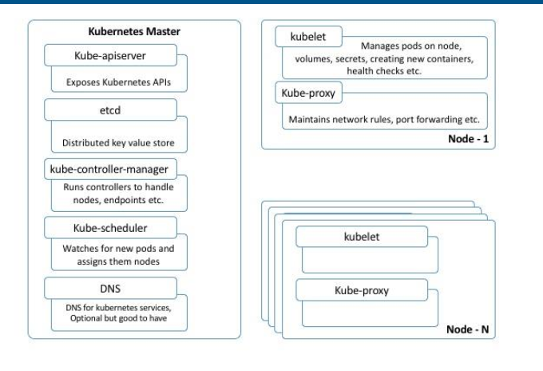
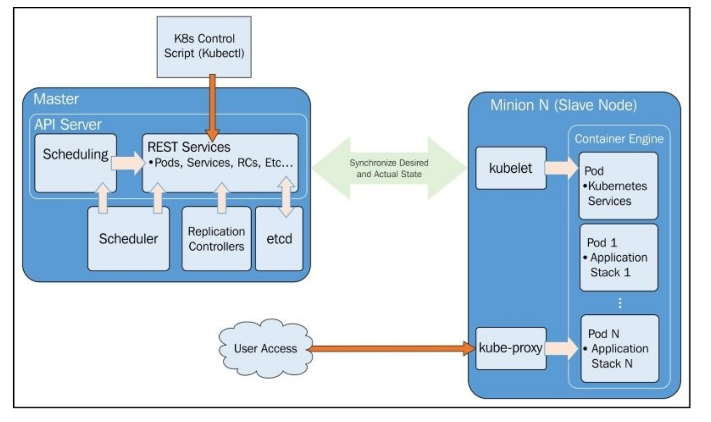
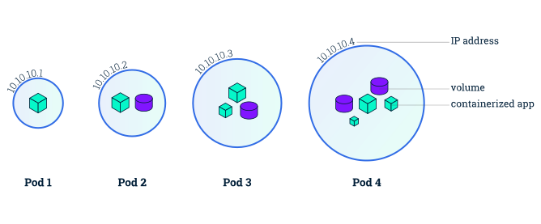
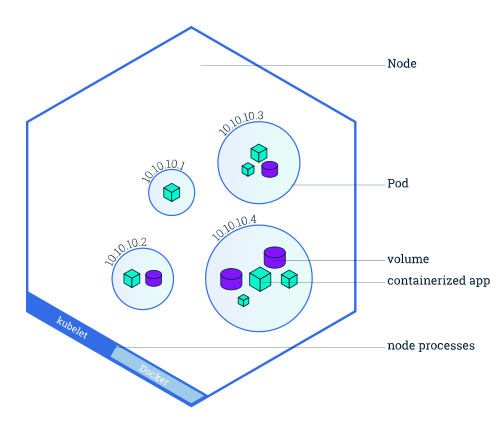
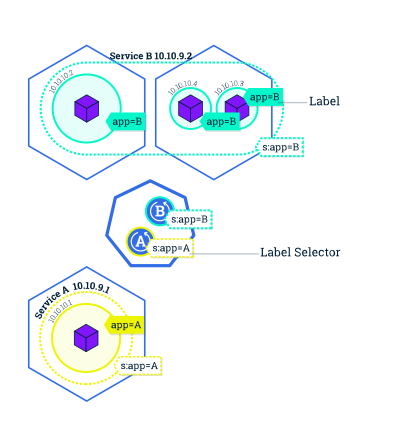

kubernetes
==========

Kubernetes is a container orchestration tool that builds upon 15 years of experience of running production workloads at Google,
combined with best-of-breed ideas and practices from the community.

Although Kubernetes is a feature-rich project, a few key features caught our attention:
namespaces, (http://kubernetes.io/docs/user-guide/namespaces/)
automated rollouts and rollbacks, (http://kubernetes.io/docs/user-guide/deployments/)
service discovery via DNS, (http://kubernetes.io/docs/user-guide/services/)
automated container scaling based on resource usage, (http://kubernetes.io/docs/user-guide/horizontal-pod-autoscaling/)
and of course, the promise of a self-healing system. (http://kubernetes.io/docs/user-guide/pod-states/#container-probes)

http://danielfm.me/posts/five-months-of-kubernetes.html

.. image:: images/k8s_03.png

Monitoring
----------

https://kubernetes.io/docs/concepts/cluster-administration/resource-usage-monitoring/

https://github.com/kubernetes/heapster

https://github.com/google/cadvisor

Running Kubernetes Locally via Minikube
---------------------------------------

https://github.com/kubernetes/minikube/releases

Installation
++++++++++++

.. code-block:: bash

    $ curl -Lo minikube https://storage.googleapis.com/minikube/releases/v0.18.0/minikube-linux-amd64 && chmod +x minikube && sudo mv minikube /usr/local/bin/

.. code-block:: bash

    $ minikube get-k8s-versions
    $ minikube start
    $ minikube start --docker-env HTTP_PROXY="http://127.0.0.1:7070"  --docker-env HTTPS_PROXY="http://127.0.0.1:7070"
    $ minikube docker-env
    $ eval $(minikube docker-env)
    $ docker ps
    $ minikube addons list
    $ minikube dashboard
    $ kubectl run hello-minikube --image=gcr.io/google_containers/echoserver:1.4 --port=8080
    $ minikube ssh cat /var/lib/boot2docker/profile
    $ minikube stop
    $ minikube delete

https://kubernetes.io/docs/getting-started-guides/minikube/#installation

https://github.com/petervandenabeele/hello-kubernetes

Minikube behind a proxy
+++++++++++++++++++++++

.. code-block:: bash

    $ minikube start  --docker-env="http_proxy=http://192.168.10.119:7070" --docker-env="https_proxy=http://192.168.10.119:7070" start

.. code-block:: bash

    $ kubectl cluster-info
    # Listing the nodes in the cluster
    $ kubectl get nodes
    # List cluster events
    $ kubectl get events
    # List services that are running in the cluster
    $ kubectl get services
    $ kubectl get pods
    $ kubectl get pods --namespace=kube-system

To start with, we will only see one service, named kubernetes .
This service is the core API server, monitoring and logging services for the pods and cluster.

Even though we have not deployed any applications on Kubernetes yet, we note that there
are several containers already running. The following is a brief description of each
container:

* fluentd-gcp (fluentd-elasticsearch by Elasticsearch and Kibana)
    This container collects and sends the cluster logs file to the Google
    Cloud Logging service.

* kube-ui
    This is the UI that we saw earlier.
* kube-controller-manager
    The controller manager controls a variety of cluster
    functions. Ensuring accurate and up-to-date replication is one of its vital roles.
    Additionally, it monitors, manages, and discovers new nodes. Finally, it manages and
    updates service endpoints.
* kube-apiserver
    This container runs the API server. As we explored in the Swagger
    interface, this RESTful API allows us to create, query, update, and remove various
    components of our Kubernetes cluster.
* kube-scheduler
    The scheduler takes unscheduled pods and binds them to nodes
* etcd
    This runs the etcd software built by CoreOS. etcd is a distributed and
    consistent key-value store. This is where the Kubernetes cluster state is stored,
    updated, and retrieved by various components of K8s.
* pause
    The Pause container is often referred to as the pod infrastructure container
    and is used to set up and hold the networking namespace and resource limits for each pod.
* kube-dns
    provides the DNS and service discovery plumbing.
* monitoring-heapster
    This is the system used to monitor resource usage across the cluster.
* monitoring-influx-grafana
    provides the database and user interface we saw earlier for monitoring the infrastructure.
* skydns
    This uses DNS to provide a distributed service discovery utility that works with etcd
* kube2Sky
    This is the connector between skydns and kubernetes . Services in the
    API are monitored for changes and updated in skydns appropriately.
* heapster
    This does resource usage and monitoring.
* exechealthz
    This performs health checks on the pods.

The environment variable
++++++++++++++++++++++++

KUBERNETES_PROVIDER

.. code-block:: bash

    $ kube-down
    $ kube-up

basic scheduling
service discovery
health checking
pods
services
replication
controllers
labels
Node (formerly minions, Note that in v1.0, minion was renamed to node,)

The pods include services for DNS, logging, and pod health checks.

Pods
++++

Pods essentially allow you to logically group containers and pieces of our application stacks together.
While pods may run one or more containers inside, the pod itself may be one of many that
is running on a Kubernetes (minion) node. As we’ll see, pods give us a logical group of
containers that we can then replicate, schedule, and balance service endpoints across.

``nodejs-pod.yaml``

.. code-block:: bash

    apiVersion: v1
    kind: Pod
    metadata:
        name: node-js-pod
    spec:
        containers:
        - name: node-js-pod
          image: bitnami/apache:latest
          ports:
          - containerPort: 80

.. code-block:: bash

    $ kubectl create -f nodejs-pod.yaml
    $ kubectl describe pods/node-js-pod

.. code-block:: bash

    $ kubectl exec node-js-pod—curl <private ip address>

By default, this runs a command in the first container it finds, but you can select a specific
one using the -c argument.

Labels
++++++

Labels are just simple key-value pairs. You will see them on pods, replication controllers,
services, and so on. The label acts as a selector and tells Kubernetes which resources to
work with for a variety of operations. Think of it as a filtering option.

Services
++++++++

Services and replication controllers give us the ability to
keep our applications running with little interruption and graceful recovery.

Services allow us to abstract access away from the consumers of our applications. Using a
reliable endpoint, users and other programs can access pods running on your cluster
seamlessly.

K8s achieves this by making sure that every node in the cluster runs a proxy named kube-
proxy. As the name suggests, kube-proxy’s job is to proxy communication from a service
endpoint back to the corresponding pod that is running the actual application.

Replication controllers (RCs)
+++++++++++++++++++++++++++++

As the name suggests, manage the number of nodes that a
pod and included container images run on. They ensure that an instance of an image is
being run with the specific number of copies.

RCs create a high-level mechanism to make sure that things are operating correctly across
the entire application and cluster.
RCs are simply charged with ensuring that you have the desired scale for your application.
You define the number of pod replicas you want running and give it a template for how to
create new pods. Just like services, we will use selectors and labels to define a pod’s
membership in a replication controller.

Kubernetes doesn't require the strict behavior of the replication controller. In fact, version
1.1 has a job controller in beta that can be used for short lived workloads which allow
jobs to be run to a completion state

``nodejs-controller.yaml``

.. code-block:: bash

    apiVersion: v1
    kind: ReplicationController
    metadata:
        name: node-js
        labels:
            name: node-js
    deployment: demo
    spec:
        replicas: 3
        selector:
            name: node-js
            deployment: demo
        template:
            metadata:
                labels:
                    name: node-js
            spec:
                containers:
                -   name: node-js
                    image: jonbaier/node-express-info:latest
                    ports:
                    - containerPort: 80

* Kind
    tells K8s what type of resource we are creating. In this case, the type is
    ReplicationController . The kubectl script uses a single create command for all
    types of resources. The benefit here is that you can easily create a number of
    resources of various types without needing to specify individual parameters for each
    type. However, it requires that the definition files can identify what it is they are
    specifying.
* ApiVersion
    simply tells Kubernetes which version of the schema we are using. All
    examples in this book will be on v1 .
* Metadata
    is where we will give the resource a name and also specify labels that willbe used to search and select resources for a given operation.
    The metadata element also allows you to create annotations, which are for nonidentifying information that
    might be useful for client tools and libraries.
* spec
    which will vary based on the kind or type of resource we are
    creating. In this case, it’s ReplicationController , which ensures the desired
    number of pods are running. The replicas element defines the desired number of
    pods, the selector tells the controller which pods to watch, and finally, the template
    element defines a template to launch a new pod. The template section contains the
    same pieces we saw in our pod definition earlier. An important thing to note is that
    the selector values need to match the labels values specified in the pod template.
    Remember that this matching is used to select the pods being managed.

.. code-block:: bash

    $ kubectl create -f nodejs-controller.yaml
    $ kubectl create -f nodejs-rc-service.yaml

A Kubernetes cluster is formed out of 2 types of resources:

    Master is coordinating the cluster
    Nodes are where we run applications

https://kubernetesbootcamp.github.io/kubernetes-bootcamp/index.html

# docker run --net=host -d gcr.io/google_containers/etcd:2.0.9 /usr/local/bin/etcd --addr=127.0.0.1:4001 --bind-addr=0.0.0.0:4001 --data-dir=/var/etcd/data
# docker run --net=host -d -v /var/run/docker.sock:/var/run/docker.sock gcr.io/google_containers/hyperkube:v0.21.2 /hyperkube kubelet --api_servers=http://localhost:8080 --v=2 --address=0.0.0.0 --enable_server --hostname_override=127.0.0.1 --config=/etc/kubernetes/manifests
# docker run -d --net=host --privileged gcr.io/google_containers/hyperkube:v0.21.2 /hyperkube proxy --master=http://127.0.0.1:8080 --v=2

Install manually
++++++++++++++++

.. code-block:: bash

    $ git clone --depth 1 https://github.com/kubernetes/kubernetes.git
    $ export KUBERNETES_PROVIDER=vagrant
    $ export KUBE_VERSION=1.2.0
    $ export FLANNEL_VERSION=0.5.0
    $ export ETCD_VERSION=2.2.0
    $ export K8S_VERSION=$(curl -sS https://storage.googleapis.com/kubernetes-release/release/stable.txt)
    $ export K8S_VERSION=$(curl -sS https://storage.googleapis.com/kubernetes-release/release/latest.txt)

Guestbook Example
-----------------

https://github.com/kubernetes/kubernetes/tree/master/examples/guestbook

Service Discovery
-----------------

There are two ways Kubernetes can implement service discovery:
through environment variables and through DNS.

Install kubectl binary via curl
-------------------------------

.. code-block:: bash

    $ curl -LO https://storage.googleapis.com/kubernetes-release/release/$(curl -s https://storage.googleapis.com/kubernetes-release/release/stable.txt)/bin/linux/amd64/kubectl
    # To download a specific version
    $ curl -LO https://storage.googleapis.com/kubernetes-release/release/v1.13.1/bin/linux/amd64/kubectl
    $ chmod +x ./kubectl
    $ sudo mv ./kubectl /usr/local/bin/kubectl

https://kubernetes.io/docs/tasks/kubectl/install/

Interactive K8S starting guide
------------------------------

.. code-block:: bash

    $ kubectl cluster-info
    # Shows all nodes that can be used to host our applications on the nodes in the cluster
    $ kubectl get nodes
    # Show both the client and the server versions
    $ kubectl version
    # Deploy our app
    $ kubectl run kubernetes-bootcamp --image=docker.io/jocatalin/kubernetes-bootcamp:v1 --port=80
        deployment "kubernetes-bootcamp" created
    # List our deployments
    $ kubectl get deployments
        NAME                  DESIRED   CURRENT   UP-TO-DATE   AVAILABLE   AGE
        kubernetes-bootcamp   1         1         1            1           4m
    $ kubectl proxy
        Starting to serve on 127.0.0.1:8001
    $ export POD_NAME=$(kubectl get pods -o go-template --template '{{range .items}}{{.metadata.name}}{{"\n"}}{{end}}')
    $ echo Name of the Pod: $POD_NAME
    $ kubectl get pods
        NAME                                  READY     STATUS    RESTARTS   AGE
        kubernetes-bootcamp-390780338-rpcw8   1/1       Running   0          12m

https://kubernetes.io/docs/tutorials/

https://kubernetes.io/docs/tutorials/kubernetes-basics/

https://kubernetes.io/docs/tutorials/kubernetes-basics/explore-intro/

Pods are the atomic unit on the Kubernetes platform.
When we create a Deployment on Kubernetes,
that Deployment creates Pods with containers inside them (as opposed to creating containers directly).
Each Pod is tied to the Node where it is scheduled,
and remains there until termination (according to restart policy) or deletion.
In case of a Node failure, identical Pods are scheduled on other available Nodes in the cluster.

A Pod always runs on a Node. A Node is a worker machine in Kubernetes and may be either a virtual or a physical machine,
depending on the cluster. Each Node is managed by the Master.
A Node can have multiple pods,
and the Kubernetes master automatically handles scheduling the pods across the Nodes in the cluster.
The Master's automatic scheduling takes into account the available resources on each Node

.. code-block:: bash

    # To view what containers are inside that Pod and what images are used to build those containers
    $ kubectl describe pods
    # Anything that the application would normally send to STDOUT becomes logs for the container within the Pod.
    $ kubectl logs $POD_NAME
    # We can execute commands directly on the container once the Pod is up and running.
    $ kubectl exec $POD_NAME
    # Start a bash session in the Pod’s container
    $ kubectl exec -ti $POD_NAME bash

A Service routes traffic across a set of Pods.
Services are the abstraction that allow pods to die and replicate in Kubernetes without impacting your application.
Discovery and routing among dependent Pods (such as the frontend and backend components in an application) is handled by Kubernetes Services.

.. image:: images/k8s_06.svg
    :width: 480pt

A Service routes traffic across a set of Pods.
Services are the abstraction that allow pods to die and replicate in Kubernetes without impacting your application.
Discovery and routing among dependent Pods (such as the frontend and backend components in an application) is handled by Kubernetes Services.

Services match a set of Pods using labels and selectors,
a grouping primitive that allows logical operation on objects in Kubernetes.
Labels are key/value pairs attached to objects and can be used in any number of ways:

    Designate objects for development, test, and production

    Embed version tags

    Classify an object using tags

.. code-block:: bash

    # List the current Services from our cluster
    $ kubectl get services
    $ kubectl expose deployment/kubernetes-bootcamp --type="NodePort" --port 8080
    $ kubectl get services
    $ kubectl describe services/kubernetes-bootcamp

Tutorials
---------

https://www.digitalocean.com/community/tutorials/modernizing-applications-for-kubernetes

Working with kubectl
--------------------

.. code-block:: bash

    $ kubectl version
    "
        Client Version: version.Info{Major:"1", Minor:"13", GitVersion:"v1.13.1", GitCommit:"eec55b9ba98609a46fee712359c7b5b365bdd920", GitTreeState:"clean", BuildDate:"2018-12-13T10:39:04Z", GoVersion:"go1.11.2", Compiler:"gc", Platform:"linux/amd64"}
        Server Version: version.Info{Major:"1", Minor:"11", GitVersion:"v1.11.6", GitCommit:"b1d75deca493a24a2f87eb1efde1a569e52fc8d9", GitTreeState:"clean", BuildDate:"2018-12-16T04:30:10Z", GoVersion:"go1.10.3", Compiler:"gc", Platform:"linux/amd64"}
    "

    $ kubectl cluster-info
    "
        Kubernetes master is running at https://192.168.0.190/k8s/clusters/c-bmbj9
        KubeDNS is running at https://192.168.0.190/k8s/clusters/c-bmbj9/api/v1/namespaces/kube-system/services/kube-dns:dns/proxy

        To further debug and diagnose cluster problems, use 'kubectl cluster-info dump'.
    "
    $ kubectl config view
    "
        apiVersion: v1
        clusters:
        - cluster:
            certificate-authority-data: DATA+OMITTED
            server: https://192.168.0.190/k8s/clusters/c-bmbj9
          name: sample-cluster
        contexts:
        - context:
            cluster: sample-cluster
            user: user-c8kmt
          name: sample-cluster
        current-context: sample-cluster
        kind: Config
        preferences: {}
        users:
        - name: user-c8kmt
          user:
            token: kubeconfig-user-c8kmt:7nlsm6vxwrtp9bl79whg42sp7k5vrtc86qskqg9ksvm6xb5dbc558n
    "

    $ kubectl get nodes
    "
        NAME         STATUS   ROLES               AGE   VERSION
        ubuntu-190   Ready    controlplane,etcd   27m   v1.11.6
        ubuntu-191   Ready    worker              12m   v1.11.6
    "

    $ kubectl top node
    "
        NAME         CPU(cores)   CPU%   MEMORY(bytes)   MEMORY%
        ubuntu-190   107m         5%     1943Mi          50%
        ubuntu-191   40m          2%     786Mi           20%
    "

    $ kubectl get events
    "
        LAST    SEEN   FIRST SEEN   COUNT   NAME  KIND     SUBOBJECT       TYPE    REASON      SOURCE      MESSAGE
        ...
    "

    $ kubectl get namespaces
    "
        NAME            STATUS   AGE
        cattle-system   Active   5d
        default         Active   5d
        ingress-nginx   Active   5d
        kube-public     Active   5d
        kube-system     Active   5d
    "

    $ kubectl create namespace sample-ns

    "
        namespace/sample-ns created
    "

    $ kubectl config get-contexts
    "
        CURRENT   NAME             CLUSTER          AUTHINFO     NAMESPACE
        *         sample-cluster   sample-cluster   user-c8kmt
    "

    $ kubectl config current-context
    "
        sample-cluster
    "

    $ kubectl config set-context sample-cluster --namespace=sample-ns
    "
        Context "sample-cluster" modified.
    "

    $ kubectl config get-contexts
    "
        CURRENT   NAME             CLUSTER          AUTHINFO     NAMESPACE
        *         sample-cluster   sample-cluster   user-c8kmt   sample-ns
    "

    $ kubectl run example-app --image=nginx:latest --port=80
    "
        kubectl run --generator=deployment/apps.v1 is DEPRECATED and will be removed in a future version. Use kubectl run --generator=run-pod/v1 or kubectl create instead.
        deployment.apps/example-app created
    "

    $ kubectl expose deployment example-app --type=NodePort
    "
        service/example-app exposed
    "

    $ kubectl run sample-app --image=nginx:latest
    "
        kubectl run --generator=deployment/apps.v1 is DEPRECATED and will be removed in a future version. Use kubectl run --generator=run-pod/v1 or kubectl create instead.
        deployment.apps/example-app created
    "

    $ kubectl expose deployment sample-app  --type=NodePort --port=80 --name=sample-service
    "
        service/sample-service exposed
    "

    $ kubectl get services  --all-namespaces
    "
        NAMESPACE       NAME                   TYPE        CLUSTER-IP      EXTERNAL-IP   PORT(S)         AGE
        default         kubernetes             ClusterIP   10.43.0.1       <none>        443/TCP         1h
        ingress-nginx   default-http-backend   ClusterIP   10.43.233.93    <none>        80/TCP          5d
        kube-system     kube-dns               ClusterIP   10.43.0.10      <none>        53/UDP,53/TCP   5d
        kube-system     metrics-server         ClusterIP   10.43.126.84    <none>        443/TCP         5d
        sample-ns       example-app            NodePort    10.43.146.159   <none>        80:31525/TCP    16m
        sample-ns       sample-service         NodePort    10.43.144.129   <none>        80:30033/TCP    5m
    "

    $ kubectl describe services
    "
        Name:                     example-app
        Namespace:                default
        Labels:                   run=example-app
        Annotations:              field.cattle.io/publicEndpoints:
                                    [{"addresses":["192.168.0.191"],"port":32093,"protocol":"TCP","serviceName":"default:example-app","allNodes":true}]
        Selector:                 run=example-app
        Type:                     NodePort
        IP:                       10.43.6.186
        Port:                     <unset>  80/TCP
        TargetPort:               80/TCP
        NodePort:                 <unset>  32093/TCP
        Endpoints:                10.42.1.41:80
        Session Affinity:         None
        External Traffic Policy:  Cluster
        Events:                   <none>

        Name:                     sample-service
        Namespace:                default
        Labels:                   run=sample-app
        Annotations:              field.cattle.io/publicEndpoints:
                                    [{"addresses":["192.168.0.191"],"port":32134,"protocol":"TCP","serviceName":"default:sample-service","allNodes":true}]
        Selector:                 run=sample-app
        Type:                     NodePort
        IP:                       10.43.167.187
        Port:                     <unset>  80/TCP
        TargetPort:               80/TCP
        NodePort:                 <unset>  32134/TCP
        Endpoints:                10.42.1.42:80
        Session Affinity:         None
        External Traffic Policy:  Cluster
        Events:                   <none>

    "
    $ kubectl get pods
    "
        NAME                          READY   STATUS    RESTARTS   AGE
        example-app-75967bd4d-b4v7g   1/1     Running   0          16m
        sample-app-7d77dc8bbc-xhrjh   1/1     Running   0          6m
    "

    $ kubectl get pods --show-labels
    "
        NAME                          READY   STATUS    RESTARTS   AGE   LABELS
        example-app-75967bd4d-ph256   1/1     Running   0          8m    pod-template-hash=315236808,run=sample-app
        sample-app-7d77dc8bbc-2h77g   1/1     Running   0          20m   pod-template-hash=3833874667,run=sample-app
    "

    $ kubectl get pods --namespace=kube-system
    "
        NAME                                      READY   STATUS      RESTARTS   AGE
        canal-f9zgh                               3/3     Running     0          45m
        canal-q2955                               3/3     Running     0          31m
        kube-dns-7588d5b5f5-drhqd                 3/3     Running     0          45m
        kube-dns-autoscaler-5db9bbb766-5jn5b      1/1     Running     0          45m
        metrics-server-97bc649d5-qbkdf            1/1     Running     0          45m
        rke-ingress-controller-deploy-job-pf6ks   0/1     Completed   0          45m
        rke-kubedns-addon-deploy-job-lgmxs        0/1     Completed   0          45m
        rke-metrics-addon-deploy-job-5swcc        0/1     Completed   0          45m
        rke-network-plugin-deploy-job-sbzbs       0/1     Completed   0          45m
    "

    $ kubectl get pods --all-namespaces
    "
        NAMESPACE       NAME                                      READY   STATUS      RESTARTS   AGE
        cattle-system   cattle-cluster-agent-57458fc9b9-lvzsx     1/1     Running     1          5d
        cattle-system   cattle-node-agent-8tqv2                   1/1     Running     0          5d
        cattle-system   cattle-node-agent-fd2wh                   1/1     Running     0          5d
        ingress-nginx   default-http-backend-797c5bc547-q2w62     1/1     Running     0          5d
        ingress-nginx   nginx-ingress-controller-7szwb            1/1     Running     0          5d
        kube-system     canal-f9zgh                               3/3     Running     0          5d
        kube-system     canal-q2955                               3/3     Running     0          5d
        kube-system     kube-dns-7588d5b5f5-drhqd                 3/3     Running     0          5d
        kube-system     kube-dns-autoscaler-5db9bbb766-5jn5b      1/1     Running     0          5d
        kube-system     metrics-server-97bc649d5-qbkdf            1/1     Running     0          5d
        kube-system     rke-ingress-controller-deploy-job-pf6ks   0/1     Completed   0          5d
        kube-system     rke-kubedns-addon-deploy-job-lgmxs        0/1     Completed   0          5d
        kube-system     rke-metrics-addon-deploy-job-5swcc        0/1     Completed   0          5d
        kube-system     rke-network-plugin-deploy-job-sbzbs       0/1     Completed   0          5d
        sample-ns       example-app-75967bd4d-clmfb               1/1     Running     0          42m
        sample-ns       sample-app-7d77dc8bbc-wkdxt               1/1     Running     0          30m
    "

    $ kubectl get deployments
    "
        NAME          DESIRED   CURRENT   UP-TO-DATE   AVAILABLE   AGE
        example-app   1         1         1            1           16m
        sample-app    1         1         1            1           6m
    "

    $ kubectl get deployments  --all-namespaces
    "
        NAMESPACE       NAME                   DESIRED   CURRENT   UP-TO-DATE   AVAILABLE   AGE
        cattle-system   cattle-cluster-agent   1         1         1            1           5d
        ingress-nginx   default-http-backend   1         1         1            1           5d
        kube-system     kube-dns               1         1         1            1           5d
        kube-system     kube-dns-autoscaler    1         1         1            1           5d
        kube-system     metrics-server         1         1         1            1           5d
        sample-ns       example-app            1         1         1            1           43m
        sample-ns       sample-app             1         1         1            1           31m
    "

    $ kubectl delete deployments --all
    "
        deployment.extensions "example-app" deleted
        deployment.extensions "sample-app" deleted
    "

    $ kubectl delete services --all
    "
        service "example-app" deleted
        service "sample-service" deleted
    "

https://kubernetes.io/docs/reference/kubectl/cheatsheet/

https://kubernetes.io/docs/tasks/run-application/run-stateless-application-deployment/

https://kubernetes.io/docs/tasks/access-application-cluster/service-access-application-cluster/

https://kubernetes.io/docs/tasks/administer-cluster/namespaces-walkthrough/#understand-the-default-namespace

Difference between targetPort and port in kubernetes Service definition
-----------------------------------------------------------------------

Port: Port is the port number which makes a service visible to other services running within the same K8s cluster.
In other words, in case a service wants to invoke another service running within the same Kubernetes cluster,
it will be able to do so using port specified against “port” in the service spec file.
port is the port your service listens on inside the cluster.

Target Port: Target port is the port on the POD where the service is running.
Taget Port is also by default the same value as port if not specified otherwise.

Nodeport: Node port is the port on which the service can be accessed from external users using Kube-Proxy.
nodePort is the port that a client outside of the cluster will "see".
nodePort is opened on every node in your cluster via kube-proxy.
With iptables magic Kubernetes (k8s) then routes traffic from that port to a matching service pod (even if that pod is running on a completely different node).
nodePort is unique, so two different services cannot have the same nodePort assigned.
Once declared, the k8s master reserves that nodePort for that service.
nodePort is then opened on EVERY node (master and worker), also the nodes that do not run a pod of that service
k8s iptables magic takes care of the routing.
That way you can make your service request from outside your k8s cluster to any node on nodePort without worrying whether a pod is scheduled there or not.

.. code-block:: bash

        apiVersion: v1
        kind: Service
        metadata:
          name: test-service
        spec:
          ports:
          - port: 8080
            targetPort: 8170
            nodePort: 33333
            protocol: TCP
          selector:
            component: test-service-app

The port is 8080 which represents that test-service can be accessed by other services in the cluster at port 8080.

The targetPort is 8170 which represents the test-service is actually running on port 8170 on pods

The nodePort is 33333 which represents that test-service can be accessed via kube-proxy on port 33333.

https://stackoverflow.com/a/49982009

https://stackoverflow.com/a/41963878

Sample Project
--------------

https://github.com/testdrivenio/flask-vue-kubernetes

https://testdriven.io/blog/running-flask-on-kubernetes/

https://github.com/hnarayanan/kubernetes-django

https://github.com/wildfish/kubernetes-django-starter/tree/master/k8s

Deploy a docker registry in the kubernetes cluster and configure Ingress with Let's Encrypt
-------------------------------------------------------------------------------------------

https://github.com/kubernetes/ingress-nginx/tree/master/docs/examples/docker-registry

Deploy a docker registry without TLS is the kubernetes cluster
--------------------------------------------------------------

Define ``namespace``, ``deployment``, ``service``  and ``ingress``
in one file called ``docker-registry-deployment.yaml``:

.. code-block:: bash

    apiVersion: v1
    kind: Namespace
    metadata:
      name: docker-registry

    ---

    apiVersion: extensions/v1beta1
    kind: Deployment
    metadata:
      name: docker-registry
      labels:
        name: docker-registry
      namespace: docker-registry
    spec:
      replicas: 1
      template:
        metadata:
          labels:
            app: docker-registry
        spec:
          containers:
          - name: docker-registry
            image: registry:2
            imagePullPolicy: Always
            ports:
            - containerPort: 5000
            env:
            - name: REGISTRY_HTTP_ADDR
              value: ":5000"
            - name: REGISTRY_STORAGE_FILESYSTEM_ROOTDIRECTORY
              value: "/var/lib/registry"
            volumeMounts:
              - name: image-store
                mountPath: "/var/lib/registry"
          volumes:
            - name: image-store
              emptyDir: {}

    ---

    kind: Service
    apiVersion: v1
    metadata:
      name: docker-registry
      namespace: docker-registry
    spec:
      selector:
        app: docker-registry
      ports:
        - port: 5000
          targetPort: 5000

    ---

    apiVersion: extensions/v1beta1
    kind: Ingress
    metadata:
      annotations:
        nginx.ingress.kubernetes.io/proxy-body-size: "0"
        nginx.ingress.kubernetes.io/proxy-read-timeout: "600"
        nginx.ingress.kubernetes.io/proxy-send-timeout: "600"
      name: docker-registry
      namespace: docker-registry
    spec:
      rules:
      - host: registry.me
        http:
          paths:
          - backend:
              serviceName: docker-registry
              servicePort: 5000
            path: /

Deploy on kubernetes:

.. code-block:: bash

    $ kubectl create -f docker-registry-deployment.yaml

Configure docker service to use local insecure registry
-------------------------------------------------------

Add ``--insecure-registry registry.me:80`` to ``docker.service`` file:

.. code-block::bash

    $ sudo vim  /lib/systemd/system/docker.service

        ExecStart=/usr/bin/dockerd  --max-concurrent-downloads 1 --insecure-registry registry.me:80 -H fd://

Or add to ``daemon.json`` file:

.. code-block:: bash

    $ vim /etc/docker/daemon.json

     {
            "insecure-registries" : ["registry.me:80"]
     }

And then restart docker:

.. code-block:: bash

    $ systemctl daemon-reload
    $ service docker restart

Add tag same as ``registry.me:80`` registry name to one image and push it to local registry:

.. code-block:: bash

    $ docker tag nginx:1.10.2 registry.me:80/nginx
    $ docker push registry.me:80/nginx

Now repo is available:

    http://registry.me/v2/nginx/tags/list

Deploy a new ``nginx`` pod from ``registry.me:80/nginx`` local registry on kubernetes:

.. code-block:: bash

    $ kubectl run nginx --image=registry.me:80/nginx

Note:

    You need to update DNS for `registry.me` on host and nodes.

https://github.com/Juniper/contrail-docker/wiki/Configure-docker-service-to-use-insecure-registry
