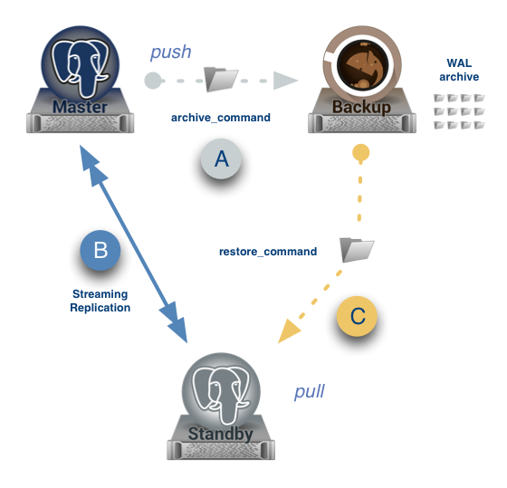

Tips
====

fix `psql: FATAL:  role "<USER>" does not exist` error
------------------------------------------------------

.. code-block:: bash

    $ psql
    psql: FATAL:  role "<USER>" does not exist

    $ sudo adduser postgres
    $ sudo passwd postgres

    $ su - postgres
    postgres@local:~$ psql
    psql (9.1.13)
    Type "help" for help.

    postgres=#

List all databases
------------------

.. code-block:: bash

    $ su - postgres
    postgres@local:~$ psql
    postgres=# \list # \l
                                 List of databases
       Name    |  Owner   | Encoding  | Collate | Ctype |   Access privileges
    -----------+----------+-----------+---------+-------+-----------------------
     postgres  | postgres | SQL_ASCII | C       | C     |
     template0 | postgres | SQL_ASCII | C       | C     | =c/postgres          +
               |          |           |         |       | postgres=CTc/postgres
     template1 | postgres | SQL_ASCII | C       | C     | =c/postgres          +
               |          |           |         |       | postgres=CTc/postgres
    (3 rows)

    postgres=#

list user accounts
------------------

.. code-block:: bash

    $ su - postgres
    postgres@local:~$ psql
    postgres=# \du
                                 List of roles
     Role name |                   Attributes                   | Member of
    -----------+------------------------------------------------+-----------
     postgres  | Superuser, Create role, Create DB, Replication | {}

    postgres=#

CREATE Database
---------------

.. code-block:: bash

    $ su - postgres
    postgres@local:~$ psql
    postgres=# CREATE DATABASE testdb;

Add or create a user account and grant permission for database
--------------------------------------------------------------

.. code-block:: bash

    $ su - postgres

    postgres@local:~$ psql

    postgres=# CREATE USER <NEW-USER> WITH PASSWORD '<USER-PASSWORD>';

    postgres=# CREATE DATABASE test_db;

    postgres=# GRANT ALL PRIVILEGES ON DATABASE <NEW-DB> to <NEW-USER>;

    postgres=# \q

Get the Size of a Postgres Table
--------------------------------

.. code-block:: bash

    postgres@ubuntu:~$ psql -d database_name -c "select pg_size_pretty(pg_relation_size('table_name'));"

Quit from psql
--------------

.. code-block:: bash

    postgres=# \q

    postgres@83abf5fff8e0:~$ whoami
    postgres

Connect to postgres from bash
-----------------------------

In root bash:

.. code-block:: bash

    $ su - postgres
    $ psql

Or:

.. code-block:: bash

    $ sudo -u postgres psql

Allow localhost to connect to postgres without password checking
----------------------------------------------------------------

.. code-block:: bash

    # vim /etc/postgresql/9.4/main/pg_hba.conf

    # "local" is for Unix domain socket connections only
    local   all             all                                     trust # peer
    # IPv4 local connections:
    host    all             all             127.0.0.1/32            trust # md5
    # IPv6 local connections:
    host    all             all             ::1/128                 trust # md5

Postgres on Docker
------------------

.. code-block:: bash

    $ docker pull postgres

    $ docker run --name postgres-01 -e POSTGRES_USER=postgres
                                    -e POSTGRES_PASSWORD=postgres  postgres

Expose Ports:

    ``5432``

Data Directories:

    ``/var/lib/postgresql/data/``

https://hub.docker.com/_/postgres/

High Availability and Load Balancing
------------------------------------

http://www.postgresql.org/docs/8.2/static/high-availability.html

There are basic 3 types of replication in postgresql i.e  Warm, hot standby and Streaming Replication.

https://github.com/zalando/patroni

https://github.com/sorintlab/stolon

https://github.com/CrunchyData/crunchy-containers

Warm Standby
++++++++++++

Its introduced in PostgreSQL 8.3(IIRC).

1. It is based on WAL log shipping which typically means WAL archives generated on Master will be transferred and applied at Standby side. So Warm Standby always waits for the WAL archive in which Master is currently writing and keeps throw messages like "cp: cannot stat <archive>: No such file or directory". So it is always one archive behind than Master and data loss will be max of 16MB(assuming a healthy warm standby by :-) )

2. In postgresql.conf file, you would need to change just three parameters in master; wal_level to archive, archive_mode and archive_command, however nothing in postgresql.conf file at standby side.
On Master:

.. code-block:: bash

    wal_level = archive
    archive_mode    = on
    archive_command = 'cp %p /path_to/archive/%f'

3. In recovery.conf file, three parameters; standby_mode, restore_command and trigger_file.
4. You cannot connect to Standby, so database is not even open for read operations (or read operations are not permitted on db).

Detailed explanation and related docs are here: http://wiki.postgresql.org/wiki/Warm_Standby

Hot Standby
+++++++++++

Its introduce in PostgreSQL 9.0.

1. It is also based on WAL log shipping(same as warm standby). And of-course,
WALs will be transferred and applied at Standby,
so one WAL behind and always waits for the WAL archive in which Master is currently writing.

2. In postgresql.conf file, you would need to change wal_level to hot_standby, archive_mode and archive_command.
Since you'll likely want to use pg_basebackup you should also set max_wal_senders to at least 2 or 3.
And hot_stanby = on in standby conf file.

On Master:

.. code-block:: bash

    wal_level = hot_standby
    max_wal_senders = 5
    wal_keep_segments = 32
    archive_mode    = on
    archive_command = 'cp %p /path_to/archive/%f'

On Slave:

.. code-block:: bash

    hot_standby = on

3. In recovery.conf file, three parameters; standby_mode, restore_command and trigger_file.

4. You can connect to Standby for read queries(you should set hot_stanby to ON in standby postgresql.conf file).

Detailed explanation and related docs are here: http://wiki.postgresql.org/wiki/Hot_Standby

Steaming Replication
++++++++++++++++++++

 Its introduced in PostgreSQL 9.0.

1. XLOG records generated in the primary are periodically shipped to the standby via the network.
XLOG records shipped are replayed as soon as possible without waiting until XLOG file has been filled.
The combination of Hot Standby and SR would make the latest data inserted into the primary visible in the standby almost immediately.
So minimal data loss(almost only open transactions will be lost if its async rep, 0 loss if it is sync rep)

2.  In postgresql.conf file, this time 5 parameters, streaming related params like below:

On Master:

.. code-block:: bash

    wal_level = hot_standby
    max_wal_senders = 5
    wal_keep_segments = 32
    archive_mode    = on
    archive_command = 'cp %p /path_to/archive/%f'

On Slave:

.. code-block:: bash

    hot_standby=on

3. In recovery.conf file, you would need to an extra parameter including three which you add in hot/warm standby.
i.e primary_conninfo, so below are four parameters:

.. code-block:: bash

    standby_mode          = 'on'
    primary_conninfo      = 'host=192.168.0.10 port=5432 user=postgres'
    trigger_file = '/path_to/trigger'
    restore_command = 'cp /path_to/archive/%f "%p"'

4. You can connect to Standby for read queries(you should set hot_stanby to ON in standby postgresql.conf file).
Detailed explanation and related docs are here:  http://wiki.postgresql.org/wiki/Streaming_Replication &&
http://bajis-postgres.blogspot.in/2013/12/step-by-step-guide-to-setup-steaming.html

Difference between Warm, hot standby and Streaming Replication:
---------------------------------------------------------------

http://bajis-postgres.blogspot.com/2014/04/difference-between-warm-hot-standby-and.html

Zero to PostgreSQL streaming replication in 10 mins
---------------------------------------------------

http://www.rassoc.com/gregr/weblog/2013/02/16/zero-to-postgresql-streaming-replication-in-10-mins/

https://wiki.postgresql.org/wiki/Binary_Replication_Tutorial

http://dba.stackexchange.com/questions/58960/configure-postgresql-recovery-again-to-be-slave

http://evol-monkey.blogspot.com/2014/01/setting-up-postgres-automated-failover.html

http://www.repmgr.org/

Understanding and controlling crash recovery
--------------------------------------------

If PostgreSQL crashes there will be a message in the server log with severity-level PANIC .
PostgreSQL will immediately restart and attempt to recover using the transaction log or Write
Ahead Log (WAL)

The WAL consists of a series of files written to the pg_xlog subdirectory of the PostgreSQL
data directory. Each change made to the database is recorded first in WAL, hence the name
"write-ahead" log. When a transaction commits, the default and safe behavior is to force the
WAL records to disk. If PostgreSQL should crash, the WAL will be replayed, which returns the
database to the point of the last committed transaction, and thus ensures the durability of
any database changes.

Note that the database changes themselves aren't written to disk at transaction commit. Those
changes are written to disk sometime later by the "background writer" on a well-tuned server.

Crash recovery replays the WAL, though from what point does it start to recover? Recovery
starts from points in the WAL known as "checkpoints". The duration of crash recovery depends
upon the number of changes in the transaction log since the last checkpoint. A checkpoint is
a known safe starting point for recovery, since at that time we write all currently outstanding
database changes to disk. A checkpoint can become a performance bottleneck on busy
database servers because of the number of writes required. There are a number of ways of
tuning that, though please also understand the effect on crash recovery that those tuning
options may cause. Two parameters control the amount of WAL that can be written before
the next checkpoint. The first is checkpoint_segments, which controls the number of 16 MB
files that will be written before a checkpoint is triggered. The second is time-based, known as
checkpoint_timeout, and is the number of seconds until the next checkpoint. A checkpoint is
called whenever either of those two limits is reached.

It's tempting to banish checkpoints as much as possible by setting the following parameters:

checkpoint_segments = 1000
checkpoint_timeout = 3600

though if you do you might give some thought to how long the recovery will be if you do and
whether you want that.

Also, you should make sure that the pg_xlog directory is mounted on disks with enough disk
space for at least 3 x 16 MB x checkpoint_segments. Put another way, you need at least 32
GB of disk space for checkpoint_segments = 1000 . If ``wal_keep_segments`` > 0 then the
server can also use up to ``16MB x (wal_keep_segments + checkpoint_segments)``.

Recovery continues until the end of the transaction log. We are writing this continually,
so there is no defined end point; it is literally the last correct record. Each WAL record is
individually CRC checked, so we know whether a record is complete and valid before trying to
process it. Each record contains a pointer to the previous record, so we can tell that the record
forms a valid link in the chain of actions recorded in WAL. As a result of that, recovery always
ends with some kind of error reading the next WAL record. That is normal.
Recovery performance can be very fast, though it does depend upon the actions being
recovered. The best way to test recovery performance is to setup a standby replication server,
described in the chapter on Replication

http://www.treatplanner.com/docs/PostgreSQL-9-Admin-Cookbook-eBook16112010_1048648.pdf

Synchronous Replication
-----------------------

PostgreSQL streaming replication is asynchronous by default.
If the primary server crashes then some transactions that were committed
may not have been replicated to the standby server, causing data loss.
The amount of data loss is proportional to the replication delay at the time of failover.

http://www.postgresql.org/docs/9.4/static/warm-standby.html

if data changes are acknowledged as sent from Master to Standby before transaction commit
is acknowledged, we refer to that as synchronous replication. If data changes are sent after a
transaction commits, we name that asynchronous replication. With synchronous replication,
the replication delay directly affects performance on the Master. With asynchronous
replication the Master may continue at full speed, though this opens up a possible risk that
the Standby may not be able to keep pace with the Master. All asynchronous replication must
be monitored to ensure that a significant lag does not develop, which is why we must be
careful to monitor the replication delay.

http://www.treatplanner.com/docs/PostgreSQL-9-Admin-Cookbook-eBook16112010_1048648.pdf

Checkpoints are points in the sequence of transactions at which it is guaranteed that the heap and
index data files have been updated with all information written before that checkpoint. At checkpoint time,
all dirty data pages are flushed to disk and a special checkpoint record is written to the log file.
(The change records were previously flushed to the WAL files.)
In the event of a crash, the crash recovery procedure looks at the latest checkpoint record to
determine the point in the log (known as the redo record) from which it should start the REDO operation.
Any changes made to data files before that point are guaranteed to be already on disk. Hence, after a checkpoint,
log segments preceding the one containing the redo record are no longer needed and can be recycled or removed.
(When WAL archiving is being done, the log segments must be archived before being recycled or removed.)

http://www.postgresql.org/docs/9.3/static/wal-configuration.html

Postgres was designed with ACID properties in mind. This is reflected in the way it works and stores data,
at the core of which is the Write-Ahead Log (WAL). Amongst other things,
the WAL allows for atomic transactions and data-safety in the face of a crash.

http://www.anchor.com.au/documentation/better-postgresql-backups-with-wal-archiving/

wal_level determines how much information is written to the WAL.
The default value is minimal, which writes only the information needed to recover from a crash or immediate shutdown.
archive adds logging required for WAL archiving; hot_standby further adds information required
to run read-only queries on a standby server; and, finally logical adds information necessary
to support logical decoding. Each level includes the information logged at all lower levels.
This parameter can only be set at server start.

http://www.postgresql.org/docs/9.4/static/runtime-config-wal.html#GUC-WAL-LEVEL

http://www.anchor.com.au/documentation/better-postgresql-backups-with-wal-archiving/

When will PostgreSQL execute archive_command to archive wal files?
------------------------------------------------------------------

The archive command is executed every time it switches the archive log to a new one.
Which as you say can be triggered manually by calling the pg_switch_xlog() function.

Other than that, an archive log needs to be changed to a new one when it is full,
which by default is when it reaches 16MB, but can be changed at compile time.

You can also specify a timeout value using the parameter archive_timeout
which will execute the command after the set amount of seconds,
which is useful for databases that have low activity.

http://dba.stackexchange.com/questions/51578/when-will-postgresql-execute-archive-command-to-archive-wal-files

http://www.postgresql.org/docs/current/static/continuous-archiving.html#BACKUP-SCRIPTS

http://thedulinreport.com/2015/01/31/configuring-master-slave-replication-with-postgresql/

The two important options for dealing with the WAL for streaming replication:

    ``wal_keep_segments`` should be set high enough to allow a slave to catch up after a reasonable lag (i.e. high update volume, slave being offline, etc...).

    archive_mode enables WAL archiving which can be used to recover files older than ``wal_keep_segments`` provides. The slave servers simply need a method to retrieve the WAL segments. NFS is the simplest method, but anything from scp to http to tapes will work so long as it can be scripted.

    # on master
    archive_mode = on
    archive_command = 'cp %p /path_to/archive/%f'

    # on slave
    restore_command = 'cp /path_to/archive/%f "%p"'

    When the slave can't pull the WAL segment directly from the master, it will attempt to use the restore_command to load it. You can configure the slave to automatically remove segments using the archive_cleanup_commandsetting.

http://stackoverflow.com/questions/28201475/how-do-i-fix-a-postgresql-9-3-slave-that-cannot-keep-up-with-the-master

http://www.mkyong.com/database/postgresql-point-in-time-recovery-incremental-backup/

http://www.pgbarman.org/faq/

Binary Replication Tools
------------------------

https://wiki.postgresql.org/wiki/Binary_Replication_Tools

warm standby or log shipping
----------------------------

A standby server can also be used for read-only queries, in which case it is called a Hot Standby server.

http://www.postgresql.org/docs/current/interactive/warm-standby.html

https://wiki.postgresql.org/wiki/Hot_Standby

https://momjian.us/main/writings/pgsql/hot_streaming_rep.pdf

It should be noted that log shipping is asynchronous, i.e., the WAL records are shipped after transaction commit.
As a result, there is a window for data loss should the primary server suffer a catastrophic failure;
transactions not yet shipped will be lost.

The size of the data loss window in file-based log shipping can be limited by use of the archive_timeout parameter,
which can be set as low as a few seconds.

However such a low setting will substantially increase the bandwidth required for file shipping.
Streaming replication (see Section 25.2.5) allows a much smaller window of data loss.

Streaming Replication
---------------------

Log-Shipping Standby Servers

Streaming replication allows a standby server to stay more up-to-date than is possible with file-based log shipping.
The standby connects to the primary, which streams WAL records to the standby as they're generated,
without waiting for the WAL file to be filled.

Streaming replication is asynchronous by default,
in which case there is a small delay between committing a transaction
in the primary and the changes becoming visible in the standby.
This delay is however much smaller than with file-based log shipping,
typically under one second assuming the standby is powerful enough to keep up with the load.
With streaming replication, archive_timeout is not required to reduce the data loss window.

If you use streaming replication without file-based continuous archiving,
the server might recycle old WAL segments before the standby has received them.
If this occurs, the standby will need to be reinitialized from a new base backup.
You can avoid this by setting ``wal_keep_segments`` to a value large enough to ensure that
WAL segments are not recycled too early, or by configuring a replication slot for the standby.
If you set up a WAL archive that's accessible from the standby, these solutions are not required,
since the standby can always use the archive to catch up provided it retains enough segments.

To use streaming replication, set up a file-based log-shipping standby server as described in Section 25.2.
The step that turns a file-based log-shipping standby into streaming replication standby
is setting ``primary_conninfo`` setting in the recovery.conf file to point to the primary server.
Set listen_addresses and authentication options (see pg_hba.conf) on the primary
so that the standby server can connect to the replication pseudo-database on the primary server.

http://www.postgresql.org/docs/current/interactive/warm-standby.html#STREAMING-REPLICATION

Introduction to Binary Replication
----------------------------------

Binary replication is also called "Hot Standby" and "Streaming Replication" which are two separate,
but complimentary, features of PostgreSQL 9.0 and later.
Here's some general information about how they work and what they are for.

PITR
----

In Point-In-Time Recovery (PITR), transaction logs are copied and saved to storage until needed.
Then, when needed, the Standby server can be "brought up" (made active) and transaction logs applied,
either stopping when they run out or at a prior point indicated by the administrator.
PITR has been available since PostgreSQL version 8.0, and as such will not be documented here.

PITR is primarily used for database forensics and recovery.
It is also useful when you need to back up a very large database,
as it effectively supports incremental backups, which pg_dump does not.

Warm Standby
------------

In Warm Standby, transaction logs are copied from the Master and applied to the Standby
immediately after they are received,
or at a short delay.
The Standby is offline (in "recovery mode") and not available for any query workload.
This allows the Standby to be brought up to full operation very quickly.
Warm Standby has been available since version 8.3, and will not be fully documented here.

Warm Standby requires Log Shipping. It is primary used for database failover.

Hot Standby
-----------

Hot Standby is identical to Warm Standby, except that the Standby is available to run read-only queries.
This offers all of the advantages of Warm Standby,
plus the ability to distribute some business workload to the Standby server(s).
Hot Standby by itself requires Log Shipping.

Hot Standby is used both for database failover, and can also be used for load-balancing.
In contrast to Streaming Replication, it places no load on the master (except for disk space requirements)
and is thus theoretically infinitely scalable.
A WAL archive could be distributed to dozens or hundreds of servers via network storage.
The WAL files could also easily be copied over a poor quality network connection, or by SFTP.

However, since Hot Standby replicates by shipping 16MB logs,
it is at best minutes behind and sometimes more than that.
This can be problematic both from a failover and a load-balancing perspective.

Streaming Replication
---------------------

Streaming Replication improves either Warm Standby or Hot Standby by opening a network connection
between the Standby and the Master database, instead of copying 16MB log files.
This allows data changes to be copied over the network almost immediately on completion on the Master.

In Streaming Replication, the master and the standby have special processes
called the walsender and walreceiver which transmit modified data pages over a network port.
This requires one fairly busy connection per standby,
imposing an incremental load on the master for each additional standby.
Still, the load is quite low and a single master should be able to support multiple standbys easily.

Streaming replication does not require log shipping in normal operation.
It may, however, require log shipping to start replication,
and can utilize log shipping in order to catch up standbys which fall behind.

https://wiki.postgresql.org/wiki/Binary_Replication_Tutorial#5_Minutes_to_Simple_Replication

Safe way to check for PostgreSQL replication delay/lag
------------------------------------------------------

http://www.postgresql.org/message-id/CADKbJJWz9M0swPT3oqe8f9+tfD4-F54uE6Xtkh4nERpVsQnjnw@mail.gmail.com

http://blog.2ndquadrant.com/monitoring-wal-archiving-improves-postgresql-9-4-pg_stat_archiver/

Does PostgreSQL 9.1 Streaming Replication catch up after a lag without WAL archiving?
-------------------------------------------------------------------------------------

http://dba.stackexchange.com/q/10540

http://dba.stackexchange.com/questions/100633/postgres-streaming-replication-how-to-re-sync-data-in-master-with-standby-aft#

http://dba.stackexchange.com/questions/90896/recovery-when-failover

http://www.postgresql.org/docs/9.2/static/pgstandby.html

http://blog.2ndquadrant.com/getting-wal-files-from-barman-with-get-wal/

http://blog.2ndquadrant.com/configuring-retention-policies-in-barman/

archive_command
---------------

When the ``archive_command`` fails, it will repeatedly retry until it succeeds. PostgreSQL does not
remove WAL files from pg_xlog until the WAL files have been successfully archived, so the
end result is that your pg_xlog directory fills up. It's a good idea to have an ``archive_command``
that reacts better to that condition, though that is left as an improvement for the
sysadmin. Typical action is to make that an emergency call out so we can resolve the problem
manually. Automatic resolution is difficult to get right as this condition is one for which it is
hard to test.

http://www.postgresql.org/docs/9.0/static/runtime-config-wal.html#GUC-ARCHIVE-COMMAND

The archive_command is only invoked for completed WAL segments.

.. code-block:: bash

    archive_command = 'test ! -f /mnt/server/archivedir/%f && cp %p /mnt/server/archivedir/%f'  # Unix

.. code-block:: bash

    test ! -f /mnt/server/archivedir/00000001000000A900000065 &&
    cp pg_xlog/00000001000000A900000065 /mnt/server/archivedir/00000001000000A900000065

It is important that the archive command return zero exit status if and only if it succeeds.
Upon getting a zero result, PostgreSQL will assume that the file has been successfully archived,
and will remove or recycle it. However, a nonzero status tells PostgreSQL that the file was not archived;
it will try again periodically until it succeeds.

The archive command is only invoked on completed WAL segments. Hence,
if your server generates only little WAL traffic (or has slack periods where it does so),
there could be a long delay between the completion of a transaction and its safe recording in archive storage.
To put a limit on how old unarchived data can be, you can set archive_timeout
to force the server to switch to a new WAL segment file at least that often. Note that archived
files that are archived early due to a forced switch are still the same length as completely full files.
It is therefore unwise to set a very short archive_timeout — it will bloat your archive storage.
archive_timeout settings of a minute or so are usually reasonable

Also, you can force a segment switch manually with pg_switch_xlog
if you want to ensure that a just-finished transaction is archived as soon as possible.

base backup
-----------

In each base backup you will find a file called backup_label. The earliest WAL file required by a physical
backup is the filename mentioned on the first line of the backup_label file. We can use a contrib
module called pg_archivecleanup to remove any WAL files earlier than the earliest file.

http://www.postgresql.org/docs/9.1/static/continuous-archiving.html

pg_basebackup
-------------

.. code-block:: bash

    pg_basebackup -d 'connection string' -D /path/to_data_dir

For PostgreSQL 9.2 and later versions, you are advised to use the following additional
option on the pg_basebackup command line. This option allows the required
WAL files to be streamed alongside the base backup on a second session, greatly
improving the startup time on larger databases, without the need to fuss over large
settings of ``wal_keep_segments`` (as seen in step 6 of the previous procedure):

.. code-block:: bash

    --xlog-method=stream

For PostgreSQL 9.4 and later versions, if the backup uses too many server resources
(CPU, memory, disk, or bandwidth), you can throttle down the speed for the backup
using the following additional option on the pg_basebackup command line. The
RATE value is specified in kB/s by default:

.. code-block:: bash

    --max-rate=RATE

https://opensourcedbms.com/dbms/point-in-time-recovery-pitr-using-pg_basebackup-with-postgresql-9-2/

base backup
-----------

In order for the standby to start replicating, the entire database needs to be archived and then reloaded into the standby.
This process is called a “base backup”, and can be performed on the master and then transferred to the slave.
Let’s create a snapshot to transfer to the slave by capturing a binary backup of the entire PostgreSQL data directory.

.. code-block:: bash

    su - postgres
    psql -c "SELECT pg_start_backup('backup', true)"
    rsync -av --exclude postmaster.pid --exclude pg_xlog /var/lib/postgresql/9.1/main/ root@slave.host.com:/var/lib/postgresql/9.1/main/
    psql -c "SELECT pg_stop_backup()"

http://blog.codepath.com/2012/02/13/adventures-in-scaling-part-3-postgresql-streaming-replication/

Postgres replica and docker
---------------------------
https://gist.github.com/mattupstate/c6a99f7e03eff86f170e

Backup Control Functions
------------------------

http://www.postgresql.org/docs/9.4/static/functions-admin.html

pg_switch_xlog()

Force switch to a new transaction log file (restricted to superusers)

PostgreSQL Streaming Replication
--------------------------------

http://blog.codepath.com/2012/02/13/adventures-in-scaling-part-3-postgresql-streaming-replication/

http://dba.stackexchange.com/questions/30609/postgresql-can-i-do-pg-start-backup-on-a-live-running-db-under-load

pg_basebackup vs pg_start_backup
--------------------------------

PostgreSQL supports Write Ahead Log (WAL) mechanism like Oracle.
So everything will be written to (redo)logs before they written into actual datafiles.
So we will use a similar method to Oracle. We need to start “the backup mode”, copy the (data) files,
and stop the backup mode, and add the archived logs to our backup.
There are SQL commands for starting backup mode (pg_start_backup) and for stopping backup mode (pg_stop_backup),
and we can copy the files using OS commands. Good thing is, since 9.1,
PostgreSQL comes with a backup tool named “pg_basebackup”.
It’ll do everything for us.

http://www.gokhanatil.com/2014/12/how-to-backup-and-restore-postgresql-9-3-databases.html

Example of Standalone Hot Backups and recovery
----------------------------------------------

To prepare for standalone hot backups, set ``wal_level`` to ``archive`` (or ``hot_standby``),
``archive_mode`` to ``on``, and set up an ``archive_command`` that performs archiving only when a switch file exists.

.. code-block:: bash

    $ vim postgresql.conf
        wal_level = hot_standby
        archive_mode = on
        archive_command = 'test ! -f /var/lib/postgresql/9.x/backup_in_progress || (test ! -f /var/lib/postgresql/9.x/archive/%f && cp %p /var/lib/postgresql/9.x/archive/%f)'

This command will perform archiving when /var/lib/pgsql/backup_in_progress exists,
and otherwise silently return zero exit status (allowing PostgreSQL to recycle the unwanted WAL file).

With this preparation, a backup can be taken using a script like the following:

.. code-block:: bash

    touch /var/lib/postgresql/9.x/backup_in_progress
    psql -c "select pg_start_backup('hot_backup');" -U postgres
    tar -cf /var/lib/postgresql/9.x/backup.tar /var/lib/postgresql/9.x/main/
    psql -c "select pg_stop_backup();" -U postgres
    rm /var/lib/postgresql/9.x/backup_in_progress
    tar -rf /var/lib/postgresql/9.x/backup.tar /var/lib/postgresql/9.x/archive/

The switch file ``/var/lib/postgresql/9.x/backup_in_progress`` is created first, enabling archiving of completed WAL files to occur.
After the backup the switch file is removed.
Archived WAL files are then added to the backup so that both base backup and
all required WAL files are part of the same tar file.
Please remember to add error handling to your backup scripts.

Note that If only ``wal_level=hot_standby`` is set in  ``postgresql.conf`` , we get this warning, after running ``pg_stop_backup`` command:

.. code-block:: bash

    root@51b1a7d96fbb:/# psql -c "select pg_stop_backup();" -U postgres
    NOTICE:  WAL archiving is not enabled; you must ensure that all required WAL segments are copied through other means to complete the backup
     pg_stop_backup
    ----------------
     0/20046E8
    (1 row)

And if only set ``wal_level=hot_standby`` and ``archive_mode=on`` are set in  ``postgresql.conf`` , we get this warning, after running ``pg_stop_backup`` command:

.. code-block:: bash

    root@51b1a7d96fbb:/# psql -c "select pg_stop_backup();" -U postgres
    NOTICE:  pg_stop_backup cleanup done, waiting for required WAL segments to be archived
    WARNING:  pg_stop_backup still waiting for all required WAL segments to be archived (60 seconds elapsed)
    HINT:  Check that your ``archive_command`` is executing properly.
    pg_stop_backup can be canceled safely, but the database backup will not be usable without all the WAL segments.

Recover data
++++++++++++

Now that the base backup is restored, you must to tell PostgreSQL how to apply the recovery procedure.
First, create file called ``recovery.conf`` in the data directory, ``/var/lib/postgresql/9.x/main/recovery.conf``.
The contents should minimally include the following line, adjusted to the location of the WAL files.

.. code-block:: bash

    $ sudo service postgresql stop
    $ sudo mv /var/lib/postgresql/9.x/main /var/lib/postgresql/9.x/_main
    $ sudo mkdir /var/lib/postgresql/9.x/restore
    $ sudo tar -xvf /var/lib/postgresql/9.x/backup.tar -C /var/lib/postgresql/9.x/restore
    $ sudo mv /var/lib/postgresql/9.x/restore/var/lib/postgresql/9.x/main/ /var/lib/postgresql/9.x/main
    $ sudo vim /var/lib/postgresql/9.x/main/recovery.conf
        restore_command = 'cp /var/lib/postgresql/9.x/archive/%f %p'
    $ sudo chown -R postgres:postgres  /var/lib/postgresql/9.x/main
    $ sudo chown -R postgres:postgres  /var/lib/postgresql/9.x/archive
    $ sudo service postgresql restart
    $ sudo tail -f /var/log/postgresql/postgresql-9.x-main.log

https://www.zetetic.net/blog/2012/3/9/point-in-time-recovery-from-backup-using-postgresql-continuo.html

https://www.zetetic.net/blog/2011/2/1/postgresql-on-ebs-moving-to-aws-part-3.html

http://www.mkyong.com/database/postgresql-point-in-time-recovery-incremental-backup/

http://www.postgresql.org/docs/9.4/static/continuous-archiving.html

Backup with pg_basebackup
-------------------------

The backup is made over a regular PostgreSQL connection,
and uses the replication protocol. The connection must be made with a superuser or a user having REPLICATION permissions,
and pg_hba.conf must explicitly permit the replication connection.
The server must also be configured with max_wal_senders set high enough to leave at least one session available for the backup.

.. code-block:: bash

    $ sudo vim /etc/postgresql/9.x/main/postgresql.conf
        max_wal_senders = 1
    $ sudo vim /etc/postgresql/9.5/main/pg_hba.conf
        local   replication      postgres                                trust
    $ sudo serivce postgresql restart
    $ sudo pg_basebackup --xlog --format=t -D /var/lib/postgresql/9.x/backup/`date +%Y%m%d` -U postgres

http://www.gokhanatil.com/2014/12/how-to-backup-and-restore-postgresql-9-3-databases.html

https://opensourcedbms.com/dbms/point-in-time-recovery-pitr-using-pg_basebackup-with-postgresql-9-2/

http://www.postgresql.org/docs/9.4/static/app-pgbasebackup.html

Find Postgresql Version
-----------------------

.. code-block:: bash

    $ sudo psql -c 'SELECT version()' -U postgres

Barman
------

.. code-block:: bash

    # On The Master SERVER
    $ sudo apt-get install rsync
    $ vim /etc/postgresql/9.x/main/postgresql.conf
        wal_level = hot_standby
        archive_mode = on
        archive_command = 'rsync -a %p barman@<BACKUP-SERVER-IP>:/var/lib/barman/main/wals/%f'

    # On The BACKUP SERVER
    $ sudo su - barman
    $ vim ~/.ssh/authorized_keys
        # add public key

    # On The Master SERVER
    $ vim ~/.ssh/authorized_keys
        # add public key

    $ vim /etc/barman.conf
        [main]
        description = "Main PostgreSQL Database"
        ssh_command = ssh root@<MASTER-SERVER-IP>
        conninfo = host=<MASTER-SERVER-IP> user=postgres

    $ barman check main

    Server main:
        PostgreSQL: OK
        archive_mode: OK
        wal_level: OK
        archive_command: OK
        continuous archiving: OK
        directories: OK
        retention policy settings: OK
        backup maximum age: OK (no last_backup_maximum_age provided)
        compression settings: OK
        minimum redundancy requirements: OK (have 0 backups, expected at least 0)
        ssh: OK (PostgreSQL server)
        not in recovery: OK

https://sourceforge.net/projects/pgbarman/files/1.6.0/

pg_receivexlog
--------------

.. code-block:: bash

    $ pg_receivexlog -D /var/lib/postgresql/9.5/backup/rxlog -U postgres

http://www.postgresql.org/docs/9.4/static/app-pgreceivexlog.html

pg_receivexlog is used to stream transaction log from a running PostgreSQL cluster.

The transaction log is streamed using the streaming replication protocol,

and is written to a local directory of files.

This directory can be used as the archive location for doing a restore using point-in-time recovery.

pg_receivexlog streams the transaction log in real time as it's being generated on the server,

and does not wait for segments to complete like ``archive_command`` does.

For this reason, it is not necessary to set ``archive_timeout`` when using ``pg_receivexlog``.

The transaction log is streamed over a regular PostgreSQL connection,

and uses the replication protocol.

The connection must be made with a superuser or a user having REPLICATION permissions,

and pg_hba.conf must explicitly permit the replication connection.

The server must also be configured with max_wal_senders set high enough to

leave at least one session available for the stream.

If the connection is lost, or if it cannot be initially established, with a non-fatal error,

``pg_receivexlog`` will retry the connection indefinitely, and reestablish streaming as soon as possible.

To avoid this behavior, use the -n parameter.

what are the pg_clog and pg_xlog directories ?
----------------------------------------------

The ``pg_xlog`` contains Postgres Write Ahead Logs (WAL, Postgres
implementation of transaction logging) files (normally 16MB in size,
each).

The ``pg_clog`` contains the commit log files which contain transaction commit
status of a transaction. One main purpose is to perform a database
recovery in case of a crash by replaying these logs.

Getting WAL files from Barman with ‘get-wal’
--------------------------------------------

Barman 1.5.0 enhances the robustness and business continuity capabilities of PostgreSQL clusters,
integrating the get-wal command with any standby server’s restore_command.

Barman currently supports only WAL shipping from the master using ``archive_command``
(Postgres 9.5 will allow users to ship WAL files from standby servers too through “archive_mode = always”
and we’ll be thinking of something for the next Barman release).

However, very frequently we see users that prefer to ship WAL files from Postgres to multiple locations,
such as one or more standby servers or another file storage destination.

In these cases, the logic of these archive command scripts can easily become quite complex and,
in the long term, dangerously slip through your grasp
(especially if PostgreSQL and its operating system are not under strict monitoring).

With 1.5.0 you can even integrate Barman with a standby server’s restore_command,
adding a fallback method to streaming replication synchronisation,
to be used in case of temporary (or not) network issues with the source of the stream
(be it a master or another standby).

All you have to do is add this line in the standby’s recovery.conf file:

.. code-block:: bash

    # Change 'SERVER' with the actual ID of the server in Barman
    restore_command = 'ssh barman@pgbackup barman get-wal SERVER %f > %p'

http://blog.2ndquadrant.com/getting-wal-files-from-barman-with-get-wal/

verifying data consistency between two postgresql databases
-----------------------------------------------------------

http://stackoverflow.com/questions/16550013/verifying-data-consistency-between-two-postgresql-databases

How to check the replication delay in PostgreSQL?
-------------------------------------------------

http://stackoverflow.com/questions/28323355/how-to-check-the-replication-delay-in-postgresql

Streaming replication slots in PostgreSQL 9.4
---------------------------------------------

http://blog.2ndquadrant.com/postgresql-9-4-slots/

Continuous Archiving and Point-in-Time Recovery (PITR)
------------------------------------------------------

http://www.postgresql.org/docs/9.4/static/continuous-archiving.html

In order to restore a backup, you need to have the base archive of all the data files,
plus a sequence of xlogs. An "incremental backup" can be made, of just some more xlogs in the sequence.
Note that if you have any missing xlogs, then recovery will stop early.

Point In Time Recovery From Backup using PostgreSQL Continuous Archving
-----------------------------------------------------------------------

https://www.zetetic.net/blog/2012/3/9/point-in-time-recovery-from-backup-using-postgresql-continuo.html

After a transaction commits on the master, the time taken to transfer data changes to a
remote node is usually referred to as the ``latency``, or ``replication delay``.
Once the remote node has received the data, changes must then be applied to the remote node, which takes an
amount of time known as the ``apply delay``. The total time a record takes from the master to a
downstream node is the ``replication delay`` plus the ``apply delay``.

Purpose of archiving in master?
-------------------------------

WAL archiving is useful when you're running streaming replication,
because there's a limit to how much WAL the master will retain.

If you don't archive WAL, and the replica gets s far behind that the master has discarded WAL it still needs,
it cannot recover and must be replaced with a fresh base backup from the master.

It's also useful for PITR for disaster recovery purposes.

Setting up file-based replication - deprecated
----------------------------------------------

1. Identify your archive location and ensure that it has sufficient space. This recipe
assumes that the archive is a directory on the standby node, identified by the
$PGARCHIVE environment variable. This is set on both the master and standby
nodes, as the master must write to the archive and the standby must read from it.
The standby node is identified on the master using $STANDBYNODE .

2. Configure replication security. Perform a key exchange to allow the master and the
standby to run the rsync command in either direction.

3. Adjust the master's parameters in postgresql.conf , as follows:

.. code-block:: bash

    wal_level = 'archive'
    archive_mode = on
    archive_command = 'scp %p $STANDBYNODE:$PGARCHIVE/%f'
    archive_timeout = 30

4. Adjust Hot Standby parameters if required (see the Hot Standby and read scalability
recipe).

5. Take a base backup, very similar to the process for taking a physical backup
described in Chapter 11, Backup and Recovery.

6. Start the backup by running the following command:

.. code-block:: bash

    psql -c "select pg_start_backup('base backup for log shipping')"

7. Copy the data files (excluding the pg_xlog directory). Note that this requires some
security configuration to ensure that rsync can be executed without needing to
provide a password when it executes. If you skipped step 2, do this now, as follows:

.. code-block:: bash

    rsync -cva --inplace --exclude=*pg_xlog* \
    ${PGDATA}/ $STANDBYNODE:$PGDATA

8. Stop the backup by running the following command:

.. code-block:: bash

    psql -c "select pg_stop_backup(), current_timestamp"

9. Set the recovery.conf parameters in the data directory on the standby server,
as follows:

.. code-block:: bash

    standby_mode = 'on'
    restore_command = 'cp $PGARCHIVE/%f %p'
    archive_cleanup_command = 'pg_archivecleanup $PGARCHIVE %r'
    trigger_file = '/tmp/postgresql.trigger.5432'

10. Start the standby server.

11. Carefully monitor the replication delay until the catch-up period is over.
During the initial catch-up period, the replication delay will be much higher than
we would normally expect it to be. You are advised to set hot_standby to off for
the initial period only.

Transaction log (WAL) files will be written on the master. Setting wal_level to archive
ensures that we collect all of the changed data, and that WAL is never optimized away. WAL is
sent from the master to the archive using ``archive_command`` , and from there, the standby
reads WAL files using restore_command . Then, it replays the changes.

The ``archive_command`` is executed when a file becomes full, or an archive_timeout
number of seconds have passed since any user inserted change data into the transaction log.
If the server does not write any new transaction log data for an extended period, then files will
switch every checkpoint_timeout seconds. This is normal, and not a problem.

The preceding configuration assumes that the archive is on the standby, so the restore_command
shown is a simple copy command ( cp ). If the archive was on a third system, then
we would need to either mount the filesystem remotely or use a network copy command.

The archive_cleanup_command ensures that the archive only holds the files that the
standby needs for restarting, in case it stops for any reason. Files older than the last file
required are deleted regularly to ensure that the archive does not overflow. Note that if the
standby is down for an extended period, then the number of files in the archive will continue
to accumulate, and eventually they will overflow. The number of files in the archive should
also be monitored.

In the configuration shown in this recipe, a contrib module named pg_archivecleanup is
used to remove files from the archive. This is a module supplied with PostgreSQL 9.0. The
pg_archivecleanup module is designed to work with one standby node at a time. Note that
pg_archivecleanup requires two parameters: the archive directory and %r , with a space
between them. PostgreSQL transforms %r into the cut-off filename.

Setting up streaming replication
--------------------------------

Log shipping is a replication technique used by many database management systems.
The master records change in its transaction log (WAL), and then the log data is shipped
from the master to the standby, where the log is replayed.

In PostgreSQL, streaming replication transfers WAL data directly from the master to the
standby, giving us integrated security and reduced replication delay.

There are two main ways to set up streaming replication: with or without an additional
archive.

1. Identify your master and standby nodes, and ensure that they have been configured
according to the Replication best practices recipe.
2. Configure replication security. Create or confirm the existence of the replication user
on the master node:

    .. code-block:: bash

        CREATE USER repuser
        SUPERUSER
        LOGIN
        CONNECTION LIMIT 1
        ENCRYPTED PASSWORD 'changeme';

3. Allow the replication user to authenticate. The following example allows access from
any IP address using MD5-encrypted password authentication; you may wish to
consider other options. Add the following line to pg_hba.conf :

    .. code-block:: bash

        Host  replication repuser 127.0.0.1/0 md5

4. Set the logging options in postgresql.conf on both the master and the standby
so that you can get more information regarding replication connection attempts and
associated failures:

    .. code-block:: bash

        log_connections = on

5. Set max_wal_senders on the master in postgresql.conf , or increase it if the
value is already nonzero:

    .. code-block:: bash

        max_wal_senders = 2
        wal_level = 'archive'
        archive_mode = on

6. Adjust ``wal_keep_segments`` on the master in postgresql.conf . Set this to a
value no higher than the amount of free space on the drive on which the pg_xlog
directory is mounted, divided by 16 MB. If pg_xlog isn't mounted on a separate
drive, then don't assume that all of the current free space is available for transaction log files.

    .. code-block:: bash

        wal_keep_segments = 10000 # e.g. 160 GB

7. Adjust the Hot Standby parameters
if required.

8. Take a base backup, very similar to the process
for taking a physical backup:

    1. Start the backup:

    .. code-block:: bash

        psql -c "select pg_start_backup('base backup for streaming rep')"

    2. Copy the data files (excluding the pg_xlog directory):

    .. code-block:: bash

        rsync -cva --inplace --exclude=*pg_xlog* \
        ${PGDATA}/ $STANDBYNODE:$PGDATA

    3. Stop the backup:

    .. code-block:: bash

        psql -c "select pg_stop_backup(), current_timestamp"

9. Set the recovery.conf parameters on the standby. Note that primary_conninfo
must not specify a database name, though it can contain any other PostgreSQL
connection option. Note also that all options in recovery.conf are enclosed in
quotes, whereas the postgresql.conf parameters need not be:

    .. code-block:: bash

        standby_mode = 'on'
        primary_conninfo = 'host=alpha user=repuser'
        trigger_file = '/tmp/postgresql.trigger.5432'

10. Start the
standby server.

11. Carefully monitor the replication delay until the catch-up period is over. During the
initial catch-up period, the replication delay will be much higher than we would
normally expect it to be.

Use pg_basebackup
+++++++++++++++++

Here is the alternative procedure, which works with PostgreSQL 9.1 using a tool called ``pg_basebackup``.
From PostgreSQL 9.2 onwards, you can run this procedure on a standby node rather than the master:

1.First, perform steps 1 to 5 of the preceding procedure.

2.Use ``wal_keep_segments`` , as shown in step 6 of the previous procedure, or in
PostgreSQL 9.4 or later, use Replication Slots (see later recipe).

3.Adjust the Hot Standby parameters if required (see later recipe).

4.Take a base backup:

    .. code-block:: bash

        pg_basebackup -d 'connection string' -D /path/to_data_dir

    For PostgreSQL 9.2 and later versions, you are advised to use the following additional
    option on the pg_basebackup command line. This option allows the required
    WAL files to be streamed alongside the base backup on a second session, greatly
    improving the startup time on larger databases, without the need to fuss over large
    settings of ``wal_keep_segments`` (as seen in step 6 of the previous procedure):

    .. code-block:: bash

        --xlog-method=stream

    For PostgreSQL 9.4 and later versions, if the backup uses too many server resources
    (CPU, memory, disk, or bandwidth), you can throttle down the speed for the backup
    using the following additional option on the pg_basebackup command line. The
    RATE value is specified in kB/s by default:

    .. code-block:: bash

        --max-rate=RATE

5.Set the recovery.conf parameters on the standby. Note that primary_conninfo
must not specify a database name, though it can contain any other PostgreSQL
connection option. Note also that all options in recovery.conf are enclosed in
quotes, whereas the postgresql.conf parameters need not be. For PostgreSQL
9.4 and later versions, you can skip this step if you wish by specifying the --write-recovery-conf option on pg_basebackup :

    .. code-block:: bash

        standby_mode = 'on'
        primary_conninfo = 'host=192.168.0.1 user=repuser'
        # trigger_file = '' # no need for trigger file 9.1+

6.Start the standby server.

7.Carefully monitor the replication delay until the catch-up period is over. During the
initial catch-up period, the replication delay will be much higher than we would
normally expect it to be.

The pg_basebackup utility also allows you to produce a compressed tar file,
using this command:

.. code-block:: bash

    pg_basebackup –F -z

Multiple standby nodes can connect to a single master. Set ``max_wal_senders`` to the
number of standby nodes, plus at least one.

If you are planning to use ``pg_basebackup –xlog-method=stream`` ,
then allow for an additional connection per concurrent backup you
plan for. You may wish to set up an individual user for each standby node, though it may be
sufficient just to set the application_name parameter in primary_conninfo .

The architecture for streaming replication is this: on the master, one WALSender process
is created for each standby that connects for streaming replication.

On the standby node, a WALReceiver process is created to work cooperatively with the master. Data transfer has
been designed and measured to be very efficient—data is typically sent in 8,192-byte chunks,
without additional buffering at the network layer.

Both WALSender and WALReceiver will work continuously on any outstanding data to be
replicated until the queue is empty.

If there is a quiet period, then WALReceiver will sleep for 100 ms at a time,
and WALSender will sleep for wal_sender_delay .

Typically, the value of wal_sender_delay need not be altered because it only affects the behavior during momentary
quiet periods. The default value is a good balance between efficiency and data protection.

If the master and standby are connected by a low-bandwidth network and the write rate on the master
is high, you may wish to lower this value to perhaps 20 ms or 50 ms.

Reducing this value will reduce the amount of data loss if the master becomes permanently unavailable, but will also
marginally increase the cost of streaming the transaction log data to the standby.

The standby connects to the master using native PostgreSQL libpq connections. This means
that all forms of authentication and security work for replication just as they do for normal
connections.

Note that, for replication sessions, the standby is the "client" and the master
is the "server", if any parameters need to be configured. Using standard PostgreSQL libpq
connections also means that normal network port numbers are used, so no additional firewall
rules are required. You should also note that if the connections use SSL, then encryption costs
will slightly increase the replication delay and the CPU resources required.

If the connection between the master and standby drops, it will take some time for that to be
noticed across an indirect network.

To ensure that a dropped connection is noticed as soon as possible, you may wish to adjust the timeout settings.
If you want a standby to notice that the connection to the master has dropped, you need to set
the wal_receiver_timeout value in the postgresql.conf file on the standby.

If you want the master to notice that a streaming standby connection has dropped, you can
set the wal_sender_timeout parameter in the postgresql.conf file on the master.

You may also wish to increase max_wal_senders to one or two more than the current
number of nodes so that it will be possible to reconnect even before a dropped connection
is noted.

This allows a manual restart to re-establish connections more easily. If you do this,
then also increase the connection limit for the replication user. Changing that setting requires
a restart.

Data transfer may stop if the connection drops or the standby server or the standby system is
shut down. If replication data transfer stops for any reason, it will attempt to restart from the
point of the last transfer. Will that data still be available? Let's see.

For streaming replication, the master keeps a number of files that is at least equal to
``wal_keep_segments`` .

If the standby database server has been down for long enough,
the master will have moved on and will no longer have the data for the last point of transfer.
If that should occur, then the standby needs to be reconfigured using the same procedure
with which we started.

For PostgreSQL 9.2 and later versions, you should plan to use pg_basebackup –xlog-
method=stream .

If you choose not to, you should note that the standby database server will
not be streaming during the initial base backup.

So, if the base backup is long enough, we
might end up with a situation where replication will never start because the desired starting
point is no longer available on the master. This is the error that you'll get:

.. code-block:: bash

    FATAL: requested WAL segment 000000010000000000000002 has already been removed

It's very annoying, and there's no way out of it—you need to start over. So, start with a very high
value of ``wal_keep_segments`` .

Don't guess this randomly; set it to the available disk space on ``pg_xlog`` divided by ``16 MB``,
or less if it is a shared disk.

If you still get that error, then you need to increase ``wal_keep_segments`` and try again

f you can't set ``wal_keep_segments`` high enough, there is an alternative. You must
configure a third server or storage pool with increased disk storage capacity, which you can
use as an archive.

The master will need to have an ``archive_command`` that places files on
the archive server, rather than the dummy command shown in the preceding procedure,
in addition to parameter settings to allow streaming to take place. The standby will need
to retrieve files from the archive using restore_command , as well as streaming using ``primary_conninfo`` .

Thus, both the master and standby have two modes for sending
and receiving, and they can switch between them should failures occur. This is the typical
configuration for large databases.

Note that this means that the WAL data will be copied
twice, once to the archive and once directly to the standby. Two copies are more expensive,
but also more robust.

The reason for setting ``archive_mode = on`` in the preceding procedure is that altering that
parameter requires a restart, so you may as well set it on just in case you need it later.

All we need to do is use a dummy ``archive_command`` to ensure that everything still works OK. By
"dummy command", I mean a command that will do nothing and then provide a return code of
zero, for example, cd or true .

One thing that is a possibility is to set ``archive_command`` only until the end of the catch-up
period. After that, you can reset it to a dummy value and then continue with only streaming
replication. Data is transferred from the master to the standby only once it has been written
(or more precisely, fsynced) to the disk.

So, setting synchronous_commit = off will not improve the replication delay,
even if it improves performance on the master.

Once WAL data is received by the standby, the WAL data is fsynced to disk on the standby to ensure that it is
not lost when the standby system restarts.

Difference between fsync and synchronous_commit ?
-------------------------------------------------

http://dba.stackexchange.com/questions/18509/difference-between-fsync-and-synchronous-commit-postgresql

http://www.postgresql.org/docs/9.3/static/runtime-config-wal.html#GUC-SYNCHRONOUS-COMMIT

standby_mode
------------

.. code-block:: bash

    standby_mode = off

When standby_mode is enabled, the PostgreSQL server will work as a
standby. It will continuously wait for the additional XLOG records, using
restore_command and/or primary_conninfo.

https://github.com/postgres/postgres/blob/master/src/backend/access/transam/recovery.conf.sample#L110

primary_conninfo
----------------

.. code-block:: bash

    primary_conninfo = ''		# e.g. 'host=localhost port=5432'

If set, the PostgreSQL server will try to connect to the primary using this connection string and
receive XLOG records continuously.

https://github.com/postgres/postgres/blob/master/src/backend/access/transam/recovery.conf.sample#L120

trigger_file
------------

.. code-block:: bash

    trigger_file = ''

By default, a standby server keeps restoring XLOG records from the
primary indefinitely. If you want to stop the standby mode, finish recovery
and open the system in read/write mode, specify a path to a trigger file.
The server will poll the trigger file path periodically and start as a
primary server when it's found.

https://github.com/postgres/postgres/blob/master/src/backend/access/transam/recovery.conf.sample#L132

http://www.archaeogeek.com/blog/2011/08/11/setting-up-a-postgresql-standby-servers/

Testing a PostgreSQL slave/master cluster using Docker
------------------------------------------------------

http://aliceh75.github.io/testing-postgresql-cluster-using-docker

Postgres streaming replication with docker
------------------------------------------

For custom configuration file,

If we do this:

.. code-block:: bash

    $ docker run --name ps-master -v /somewhere/postgres/master/data:/var/lib/postgresql/data postgres:9.4
    $ docker start  ps-master
    $ vim /somewhere/postgres/master/data/postgresql.conf
    $ vim /somewhere/postgres/master/data/pg_hba.conf
    $ docker restart  ps-master

As you see, then we need to edit that files and restart server again.

Also because of this error:

.. code-block:: bash

    initdb: directory "/var/lib/postgresql/data" exists but is not empty

We can't do in this way:

.. code-block:: bash

    $ docker run --rm --name ps-master  \
    -v /somewhere/postgres/data:/var/lib/postgresql/data \
    -v /somewhere/postgres/postgresql.conf:/var/lib/postgresql/data/postgresql.conf \
    -v /somewhere/postgres/pg_hba.conf:/var/lib/postgresql/data/pg_hba.conf \
    postgres:9.4

But we can use this way by putting some script on special ``docker-entrypoint-initdb.d`` directory:

.. code-block:: bash

    $ docker run --rm --name ps-master
    -v /somewhere/postgres/data:/var/lib/postgresql/data
    -v /somewhere/postgres/script:/docker-entrypoint-initdb.d
    -v /somewhere/postgres/config:/config postgres:9.4

.. code-block:: bash

    $ ls -la /somewhere/postgres/script

        drwxr-xr-x 2 postgres postgres 4096 Apr  2 12:22 .
        drwxr-xr-x 7 postgres postgres 4096 Apr  2 12:18 ..
        -rw-r--r-- 1 postgres postgres  169 Apr  2 12:22 copy_configuration_files.sh

    $ cat /somewhere/postgres/script/copy_configuration_files.sh

    #!/bin/bash
    echo "Copy configuration files !!"
    cp /config/postgresql.conf /var/lib/postgresql/data/postgresql.conf
    cp /config/pg_hba.conf /var/lib/postgresql/data/pg_hba.conf

    $ ls -la /somewhere/postgres/config

    drwxr-xr-x 2 postgres postgres  4096 Apr  2 12:22 .
    drwxr-xr-x 7 postgres postgres  4096 Apr  2 12:18 ..
    -rw------- 1 postgres postgres  4523 Apr  2 12:21 pg_hba.conf
    -rw------- 1 postgres postgres 21350 Apr  2 12:22 postgresql.conf

    docker run --rm --name ps-master  \
    -v /somewhere/postgres/data:/var/lib/postgresql/data \
    -v /somewhere/postgres/postgresql.conf:/usr/share/postgresql/9.4/postgresql.conf.sample \
    -v /somewhere/postgres/pg_hba.conf:/usr/share/postgresql/9.4/pg_hba.conf.sample \
    postgres:9.4

https://github.com/docker-library/postgres/issues/105

https://github.com/docker-library/postgres/pull/127

Show the value of a run-time parameter
--------------------------------------

.. code-block:: bash

    $ psql -U postgres
    postgres=# SHOW ALL;
    postgres=# SHOW hba_file;

http://www.postgresql.org/docs/8.2/static/sql-show.html

Postgres DB Size Command
------------------------

.. code-block:: bash

    postgres=# select pg_database_size('databaseName');

.. code-block:: bash

    postgres=# select t1.datname AS db_name,
        pg_size_pretty(pg_database_size(t1.datname)) as db_size
        from pg_database t1
        order by pg_database_size(t1.datname) desc;

.. code-block:: bash

    postgres=# \l+

.. code-block:: bash

    postgres=# SELECT
        pg_database.datname,
        pg_size_pretty(pg_database_size(pg_database.datname)) AS size
        FROM pg_database;

.. code-block:: bash

    postgres=# SELECT
        t.tablename,
        indexname,
        c.reltuples AS num_rows,
        pg_size_pretty(pg_relation_size(quote_ident(t.tablename)::text)) AS table_size,
        pg_size_pretty(pg_relation_size(quote_ident(indexrelname)::text)) AS index_size,
        CASE WHEN indisunique THEN 'Y'
           ELSE 'N'
        END AS UNIQUE,
        idx_scan AS number_of_scans,
        idx_tup_read AS tuples_read,
        idx_tup_fetch AS tuples_fetched
    FROM pg_tables t
    LEFT OUTER JOIN pg_class c ON t.tablename=c.relname
    LEFT OUTER JOIN
        ( SELECT c.relname AS ctablename, ipg.relname AS indexname, x.indnatts AS number_of_columns, idx_scan, idx_tup_read, idx_tup_fetch, indexrelname, indisunique FROM pg_index x
               JOIN pg_class c ON c.oid = x.indrelid
               JOIN pg_class ipg ON ipg.oid = x.indexrelid
               JOIN pg_stat_all_indexes psai ON x.indexrelid = psai.indexrelid )
        AS foo
        ON t.tablename = foo.ctablename
    WHERE t.schemaname='public'
    ORDER BY 1,2;

https://gist.github.com/next2you/628866#file-postgres-long-running-queries-sql

Multi-master replication
------------------------

http://stackoverflow.com/questions/19657514/multi-master-replication-in-postgresql

https://en.wikipedia.org/wiki/Multi-master_replication

https://wiki.postgresql.org/wiki/Replication,_Clustering,_and_Connection_Pooling#Comparison_matrix

https://www.cybertec-postgresql.com/en/postgresql-affiliate-projects-for-horizontal-multi-terabyte-scaling/
